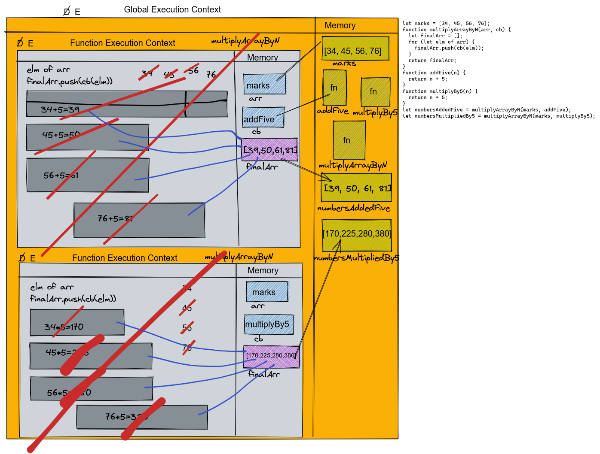

1. Which all function is Higher order function and which one is a callback function in the code given below.

```js
let marks = [34, 45, 56, 76];
function multiplyArrayByN(arr, cb) { // Higher order function
  let finalArr = [];
  for (let elm of arr) {
    finalArr.push(cb(elm));
  }
  return finalArr;
}
function addFive(n) { // Callback function
  return n + 5;
}
function multiplyBy5(n) { // Callback function
  return n * 5;
}
let numbersAddedFive = multiplyArrayByN(marks, addFive);
let numbersMultipliedBy5 = multiplyArrayByN(marks, multiplyBy5);
```

2. Create the execution context diagram of the above code snippet


3. Write a higher order function that accepts a number and a operation function (callback function). Call the callback function passing the number as argument and return the returned value.

```js
function operation(n, opFn) {
  // your code goes her
  return (opFn(n));
}
function divideBy5(n) {
  return n / 10;
}
function multiplyAndHalf(n) {
  return (n * n) / 5;
}
// TEST
console.log(operation(21, divideBy5));
// Output: 2.1
console.log(operation(10, multiplyAndHalf));
// Output: 20
```

4. Write a higher order function that accepts a string and a operation function (callback function). Call the callback function passing the string as argument and return the returned value.

```js
function operation(str, opFn) {
  // your code goes her
  return (opFn(str));
}
function upperCase(text) {
  return text.toUpperCase();
}
function splitText(text) {
   return text.split(" ");
}
// TEST
console.log(operation("Learning to fly", upperCase));
// Output: "LEARNING TO FLY"
console.log(operation("Higher Order Fucntion", splitText));
// Output: ["Higher","Order","Function"]
```
